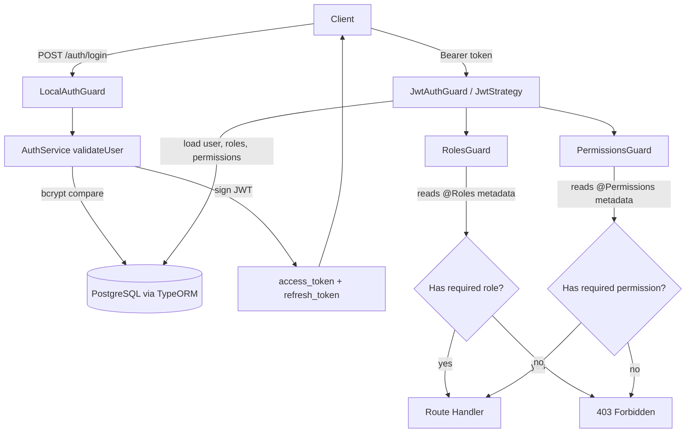

<div align="center">

# nestJs-role-CBAC


**A NestJS backend that demonstrates role based and permission (claim) based access control, with JWT authentication and PostgreSQL.**

</div>

> **Status note:** This is a learning project. Role based access control (RBAC) and permission based access control (CBAC) both work end to end through Passport, JWT, custom guards, and decorators backed by TypeORM entities. CASL is present as a dependency and a `CaslModule` is wired in, but the `CaslAbilityFactory` is an empty stub and is not used by any guard yet. See the [Roadmap](#roadmap) for what is planned. The code also contains demo `console.log` statements and short lived tokens, which are fine for learning but not production ready.

## Table of Contents

- [About](#about)
- [Features](#features)
- [Tech Stack](#tech-stack)
- [Architecture](#architecture)
- [Getting Started](#getting-started)
- [Key Endpoints](#key-endpoints)
- [Project Structure](#project-structure)
- [Configuration](#configuration)
- [Roadmap](#roadmap)
- [Contributing](#contributing)
- [License](#license)

## About

This repository shows how to protect a NestJS API with two layers of authorization:

- **Role based access control (RBAC):** a user has one or more roles such as `admin`, `editor`, or `user`. A `RolesGuard` checks the roles required by a route against the roles on the authenticated user.
- **Permission (claim) based access control (CBAC):** roles carry fine grained permissions such as `permission.create.user` or `permission.read.user`. A `PermissionsGuard` checks the permissions required by a route against the permissions the user holds through their roles.

Authentication is handled by Passport with two strategies: a local strategy for username and password login, and a JWT strategy for protecting routes. Users, roles, and permissions are stored in PostgreSQL through TypeORM with many to many relations. A `faker` endpoint seeds demo roles, permissions, and users so you can try the flow quickly.

## Features

- JWT authentication with access and refresh tokens (Passport local and JWT strategies).
- Password hashing with bcrypt.
- Role based guard and `@Roles()` decorator for RBAC.
- Permission based guard and `@Permissions()` decorator for CBAC.
- TypeORM entities for `User`, `Role`, and `Permission` with many to many relations.
- A helper that resolves a user's effective permissions from their roles.
- A faker module that seeds demo roles, permissions, and users in one request.
- PostgreSQL with TypeORM `synchronize` enabled for fast local setup.

## Tech Stack

| Layer | Technology |
|-------|------------|
| Runtime | Node.js |
| Framework | NestJS 10 |
| Language | TypeScript 5 |
| Auth | Passport, `passport-local`, `passport-jwt`, `@nestjs/jwt` |
| Hashing | bcrypt |
| ORM | TypeORM 0.3 |
| Database | PostgreSQL (`pg` driver) |
| Config | `@nestjs/config` |
| Authorization (planned) | `@casl/ability` (stubbed, not yet used) |
| Testing | Jest, Supertest |

## Architecture

The diagram below shows how a request to a protected route flows through the guards.



## Getting Started

### Prerequisites

```bash
# Node.js 18 or newer and npm
node -v

# A running PostgreSQL instance and a database you can connect to
```

### Installation

```bash
git clone https://github.com/atiqbitstream/nestJs-role-CBAC.git
cd nestJs-role-CBAC
git checkout nestjs-castl
npm install
```

Create a `.env` file in the project root with your database settings (see [Configuration](#configuration)), then start the app:

```bash
# development
npm run start

# watch mode
npm run start:dev

# production mode
npm run build
npm run start:prod
```

The server listens on **http://localhost:3000**.

Seed demo data (roles, permissions, and three sample users) with one request:

```bash
curl -X POST http://localhost:3000/faker
```

### Tests

```bash
npm run test       # unit tests
npm run test:e2e   # end to end tests
npm run test:cov   # coverage
```

## Key Endpoints

| Method | Path | Guard | Description |
|--------|------|-------|-------------|
| `POST` | `/users/signup` | none | Create a user with username, email, and password. |
| `POST` | `/auth/login` | `LocalAuthGuard` | Log in and receive `access_token` and `refresh_token`. |
| `POST` | `/refresh` | none | Exchange a valid `refresh_token` for a new `access_token`. |
| `GET` | `/profile` | `JwtAuthGuard` | Return the authenticated user. |
| `GET` | `/users` | `JwtAuthGuard` + `PermissionsGuard` | List users. Requires the `permission.create.announcement` permission. |
| `POST` | `/faker` | none | Seed demo roles, permissions, and users. |

## Project Structure

```text
src/
├── app.controller.ts        Login, profile, and refresh token routes
├── app.module.ts            Root module, TypeORM and config setup
├── main.ts                  Bootstrap, listens on port 3000
├── auth/
│   ├── auth.service.ts      Validate user, sign access and refresh tokens
│   ├── constants.ts         JWT secret placeholder (see Issues)
│   ├── decorators/          @Roles, @Permissions, @CurrentUser
│   ├── entities/            Role and Permission entities
│   ├── enums/               Role, permission, and action enums
│   ├── guards/              JWT, local, roles, and permissions guards
│   ├── modifier/            getClientPermissions helper
│   └── strategies/          Local and JWT Passport strategies
├── users/
│   ├── users.service.ts     Create, find, and update users (bcrypt)
│   ├── users.controller.ts  Signup and guarded list route
│   ├── dto/                 Create, update, and find DTOs
│   └── entities/            User entity with roles and permissions
├── casl/                    CaslModule and ability factory (stub)
└── faker/                   Demo data seeder
```

## Configuration

The database connection is read from environment variables through `@nestjs/config`. Create a `.env` file in the project root:

| Variable | Description | Example |
|----------|-------------|---------|
| `DB_HOST` | PostgreSQL host | `localhost` |
| `DB_PORT` | PostgreSQL port | `5432` |
| `DB_USERNAME` | Database user | `postgres` |
| `DB_PASSWORD` | Database password | `postgres` |
| `DB_DATABASE` | Database name | `cbac` |

TypeORM runs with `synchronize: true`, so tables are created automatically from the entities. This is convenient for local development but should not be used in production.

> **Security:** The JWT signing secret is hardcoded as a placeholder in `src/auth/constants.ts`. The value itself is a "do not use" reminder string, not a real secret, but you should move it to an environment variable before using this anywhere real.

## Roadmap

- [ ] Implement the `CaslAbilityFactory` and use CASL for ability based checks.
- [ ] Move the JWT secret out of source code and into an environment variable.
- [ ] Combine role permissions and directly assigned permissions in `getClientPermissions`.
- [ ] Remove demo `console.log` statements.
- [ ] Add input validation and consistent error responses.
- [ ] Increase the access token lifetime to a practical value.
- [ ] Provide a `.env.example` file.

## Contributing

Contributions are welcome. Open an issue to discuss a change, then send a pull request.

## License

Distributed under the MIT License. See [LICENSE](LICENSE).
